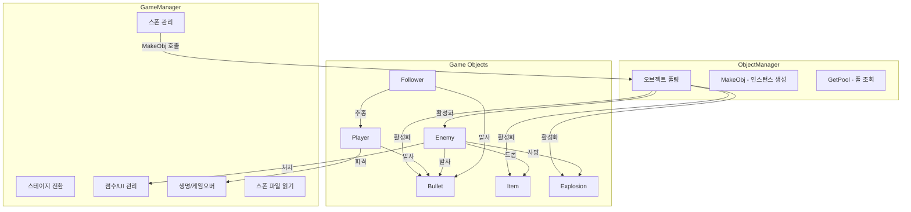
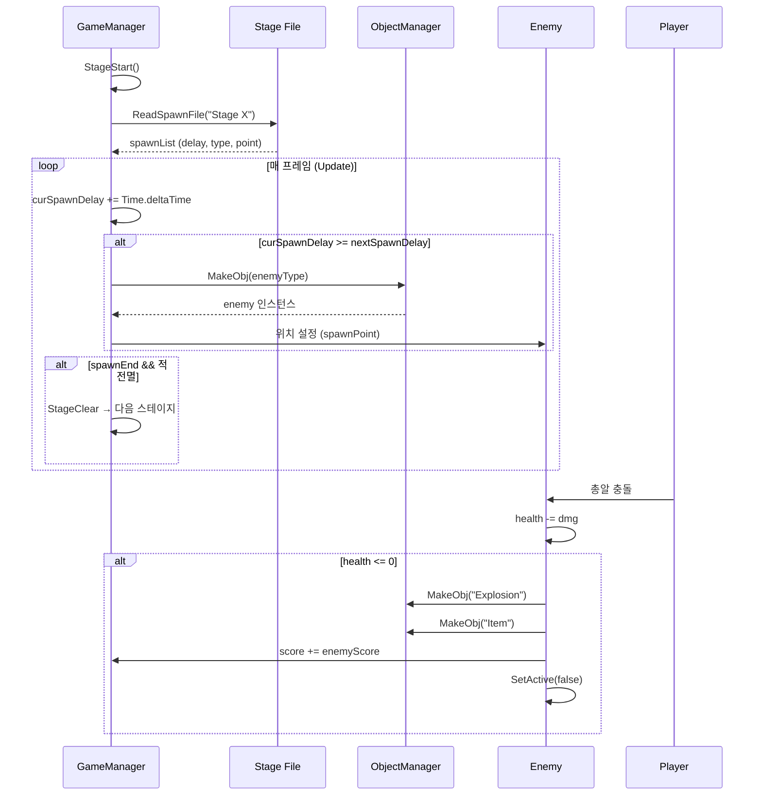

# Architecture

## Unity 프로젝트 구조

### 씬 구조

```
Main Scene
├── Main Camera
├── Canvas (UI)
│   ├── ScoreText
│   ├── LifeImages[]
│   ├── BoomImages[]
│   ├── StageAnimator
│   ├── ClearAnimator
│   ├── FadeAnimator
│   └── GameOverSet
├── Player
│   ├── Animator
│   ├── SpriteRenderer
│   └── Followers[]
├── SpawnPoints[]
├── Background
│   └── Sprites[] (무한 스크롤)
├── GameManager
├── ObjectManager
│   └── (오브젝트 풀 인스턴스들)
└── Borders
    └── BorderBullet (화면 밖 총알 제거)
```

### Manager 패턴

게임의 핵심 로직은 두 개의 Manager로 분리됩니다:



### 오브젝트 풀링 시스템

`ObjectManager`는 대량의 게임 오브젝트를 효율적으로 관리합니다:

```
오브젝트 풀 사이즈:
┌─────────────────────┬───────┐
│ 오브젝트             │ 풀 수 │
├─────────────────────┼───────┤
│ Boss                │   1   │
│ EnemyL              │  10   │
│ EnemyM              │  10   │
│ EnemyS              │  20   │
│ ItemCoin            │  20   │
│ ItemPower           │  10   │
│ ItemBoom            │  10   │
│ BulletPlayerA       │ 100   │
│ BulletPlayerB       │ 100   │
│ BulletEnemyA        │ 100   │
│ BulletEnemyB        │ 100   │
│ BulletFollower      │ 100   │
│ BulletBossA         │  50   │
│ BulletBossB         │  50   │
│ Explosion           │  20   │
└─────────────────────┴───────┘
```

**풀링 흐름:**
```
MakeObj(type) 호출
  → targetPool에서 비활성 오브젝트 검색
  → 비활성 오브젝트 있음 → SetActive(true) → 반환
  → 비활성 오브젝트 없음 → Instantiate() → 풀에 추가 → 반환
```

### 게임 루프



### 스폰 파일 포맷

`Resources/Stage X.txt` (CSV):

```
delay,type,point
2.0,EnemyS,0
0.5,EnemyS,2
1.0,EnemyM,1
3.0,EnemyL,3
5.0,Boss,1
```

| 필드 | 설명 |
|------|------|
| delay | 이전 스폰 이후 대기 시간(초) |
| type | 적 타입 (EnemyS, EnemyM, EnemyL, Boss) |
| point | spawnPoints[] 인덱스 |

### 배경 무한 스크롤

`Background.cs`는 여러 배경 스프라이트를 아래로 이동시키며, 화면 밖으로 나간 스프라이트를 맨 위로 재배치합니다:

```
[Sprite 0] ← startIndex
[Sprite 1]
[Sprite 2] ← endIndex

endIndex가 화면 아래로 나가면:
→ startIndex 위로 재배치
→ 인덱스 순환
```

### 충돌 감지

Unity 2D 물리 시스템 (`OnTriggerEnter2D`) 사용:

| 충돌 관계 | Tag 조건 | 결과 |
|-----------|----------|------|
| 플레이어 총알 → 적 | Enemy | 적 체력 감소 |
| 적 총알 → 플레이어 | Player | 플레이어 피격 |
| 아이템 → 플레이어 | Player | 아이템 효과 적용 |
| 총알 → 화면 밖 | BorderBullet | 총알 비활성화 |
